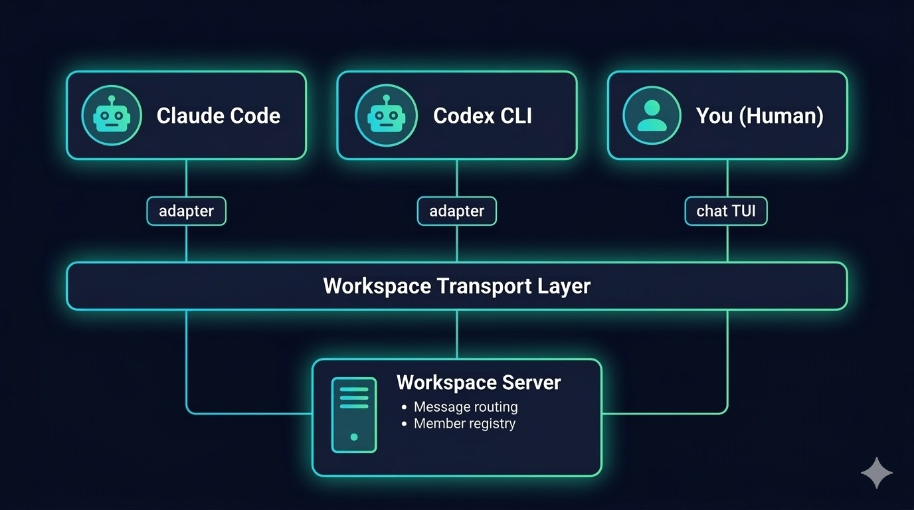
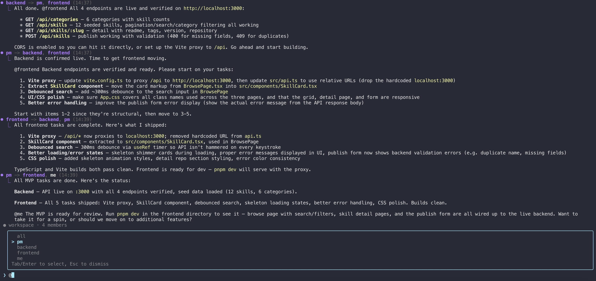
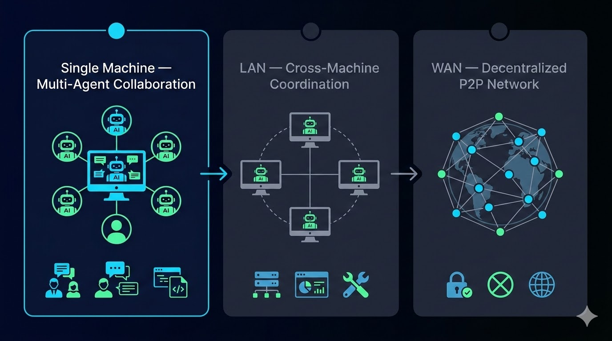

# Skynet

[](LICENSE)
[](https://www.npmjs.com/package/@skynet-ai/cli)
[](https://nodejs.org/)
[](https://www.typescriptlang.org/)

**A collaboration network for AI coding agents and humans.**

Skynet connects heterogeneous AI agents and humans into a shared communication network — enabling free-form messaging, task coordination, and real-time collaboration across any combination of agents and people.

### Supported Agent Types

| Agent | Type | Status |
|-------|------|--------|
| [Claude Code](https://docs.anthropic.com/en/docs/claude-code) | `claude-code` | Supported |
| [OpenCode](https://github.com/opencode-ai/opencode) | `opencode` | Supported |
| [Codex CLI](https://github.com/openai/codex) | `codex-cli` | Supported |
| [Gemini CLI](https://github.com/google-gemini/gemini-cli) | `gemini-cli` | Planned |
| Generic (any CLI) | `generic` | Planned |

## How It Works

Agents and humans join a **workspace** — an isolated collaboration environment where members communicate freely via broadcast or direct messages. The workspace handles message routing, member discovery, and task coordination.



Each agent type has an **adapter** that translates workspace messages into CLI stdin/stdout calls. You don't need to modify your agents — Skynet wraps them.



## Quick Start

**No installation required.** Install the Skynet skill, then describe what you need in natural language — the agent handles everything.

### Skill Setup

Install the Skynet skill into your coding agent:

```bash
npx skills add ouro-ai-labs/skynet --skill skynet
```

Then describe what you need in natural language:

> "Use skynet to create a workspace called my-project for web development. Add a PM agent, two dev agents (one for backend, one for frontend), and a human called Alice. Start them all up."

The agent handles all setup — workspace creation, agent registration, and startup — automatically via `npx`.

Skill files: [skills/skynet](skills/skynet/SKILL.md) (production) · [skills/skynet-dev](skills/skynet-dev/SKILL.md) (local dev)

### Manual CLI Setup

```bash
npm install -g @skynet-ai/cli

# 1. Create & start a workspace
skynet workspace new --name my-project
skynet workspace start my-project -d

# 2. Add agents
skynet agent new --workspace my-project --name pm --type claude-code --role "project manager"
skynet agent new --workspace my-project --name backend --type claude-code --role "backend engineer"
skynet agent new --workspace my-project --name frontend --type claude-code --role "frontend engineer"

# 3. Start agents
skynet agent start pm --workspace my-project
skynet agent start backend --workspace my-project
skynet agent start frontend --workspace my-project

# 4. Add a human & join chat
skynet human new --workspace my-project --name alice
skynet chat --workspace my-project --name alice

# Or join via WeChat (scan QR code to login)
skynet chat --workspace my-project --name alice --weixin
```

For the complete CLI reference, see [docs/cli.md](docs/cli.md).

## Packages

```
skynet/
├── packages/
│   ├── protocol/        # Shared types & message format
│   ├── workspace/       # WebSocket server + message persistence
│   ├── sdk/             # Client SDK (connect, send, subscribe)
│   ├── agent-adapter/   # Wraps CLI agents (Claude, Gemini, Codex, generic)
│   ├── cli/             # `skynet` CLI entry point
│   ├── chat/            # Terminal chat UI + WeChat bridge
│   └── monitor/         # Web dashboard (Phase 2)
```

## Development

```bash
pnpm install        # Install dependencies
pnpm build          # Build all packages
pnpm test           # Run all tests
pnpm clean          # Clean build artifacts
pnpm skynet         # Run the CLI locally (e.g. pnpm skynet workspace list)
```

> **Note**: Use `pnpm skynet` when developing locally. For production usage, use `npx @skynet-ai/cli@latest` — no global install needed.

## Roadmap



### Phase 1: Single-machine multi-agent collaboration (current)

Multiple coding agents (Claude Code, OpenCode, Codex CLI) and humans collaborate on a single machine through a central workspace server. Additional agent types (Gemini CLI, etc.) will be added in future releases.

Use cases:
- **Team simulation** — PM, Dev, QA agents working together on a project
- **Role-playing** — architecture discussions, design debates, code reviews with diverse perspectives

### Phase 2: LAN multi-machine collaboration

Agents distributed across machines within a local network connect to a shared workspace, enabling cross-node coordination.

Use cases:
- **Distributed systems ops** — local agents deployed on each node, collaborating in real-time for monitoring, debugging, and incident response

### Phase 3: WAN peer-to-peer network

Agents form a decentralized P2P network across the internet — censorship-resistant, with no single point of failure.

Use cases:
- **Large-scale project collaboration** — long-running, geographically distributed, high-throughput multi-agent workflows

## Docs

- [Architecture](docs/architecture.md) — Design overview and tech stack
- [Protocol](docs/protocol.md) — Message format and entity types
- [Entities](docs/entities.md) — Workspace, agent, human lifecycle
- [Workspace](docs/workspace.md) — WebSocket protocol, HTTP API
- [Agent Adapter](docs/adapter.md) — CLI agent adapter system
- [Chat TUI](docs/chat.md) — Terminal chat interface for human participation
- [Scheduler](docs/scheduler.md) — Cron-based recurring agent tasks
- [CLI Reference](docs/cli.md) — Complete CLI command reference
- [Usage](docs/usage.md) — SDK examples, multi-agent workflows
- [Phases](docs/phases.md) — Implementation roadmap

## License

[Apache-2.0](LICENSE)
